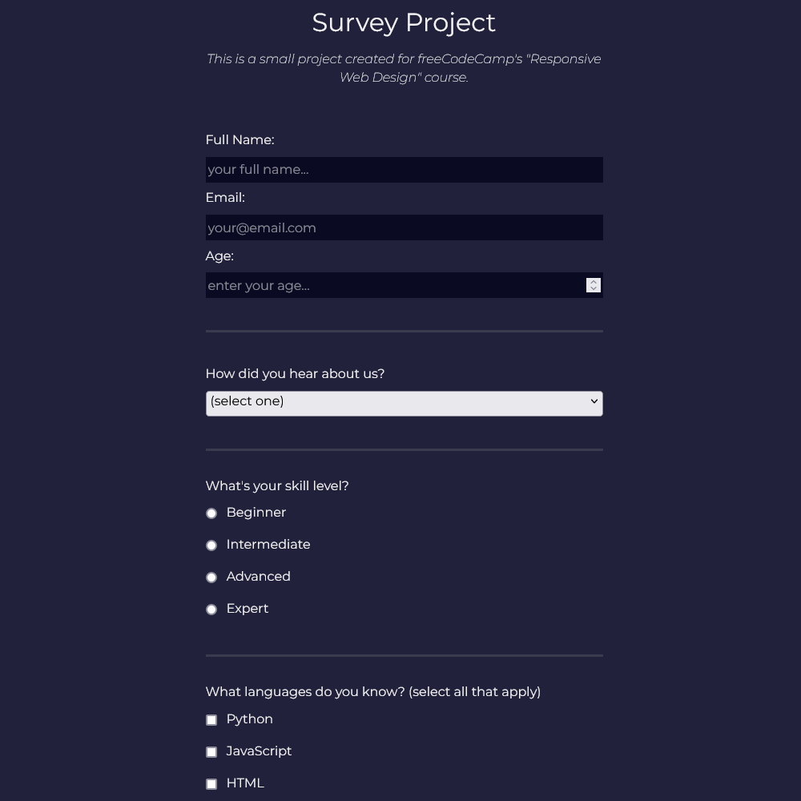

# freeCodeCamp - Survey Form Project

This project was completed for the Survey Form certification project on freeCodeCamp as part of their [Responsive Web Design](https://www.freecodecamp.org/learn/2022/responsive-web-design) course. Frontend Mentor challenges help you improve your coding skills by building realistic projects.

## Table of contents

-   [Overview](#overview)
    -   [Screenshot](#screenshot)
    -   [Links](#links)
-   [My process](#my-process)
    -   [Built with](#built-with)
    -   [What I learned](#what-i-learned)
-   [Author](#author)

## Overview

### Screenshot



### Links

-   Live Site URL: [Click Here](https://imtypicalt.github.io/fcc-survey-form/)

## My process

### Built with

-   HTML5
-   CSS

### What I learned

Getting some hands on experience with all the different components you can use inside an HTML form like radio buttons, check boxes, text areas and selection dropdowns. It was also nice getting to understand how to build out a form and target the individual components with custom CSS classes.

```css
.checkbox {
    width: unset;
    display: inline-block;
    margin: 0 0.5em 0 0;
    vertical-align: middle;
}
```

```html
<label for="javascript">
    <input
        id="javascript"
        value="javascript"
        name="javascript"
        type="checkbox"
        class="checkbox"
    />
    JavaScript
</label>
```

## Author

-   [Website](https://imtypicalt.github.io/portfolio/)
-   [Threads](https://www.threads.net/@imtypicalt)
-   [Twitter](https://twitter.com/imTypicalT)
